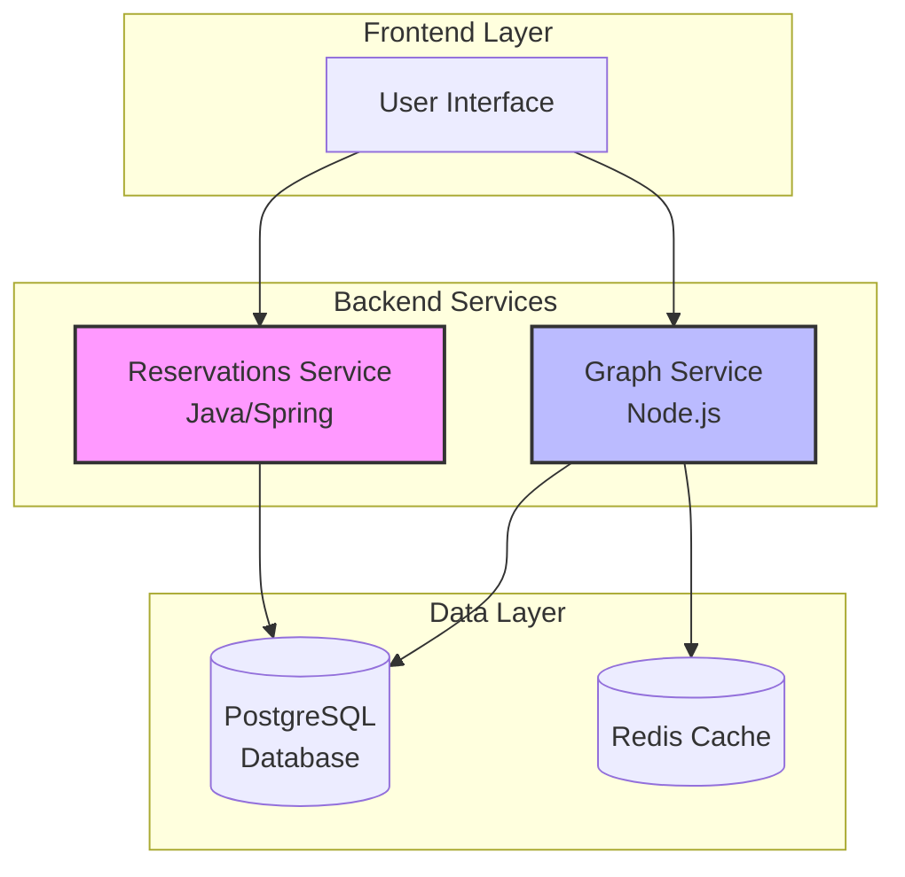
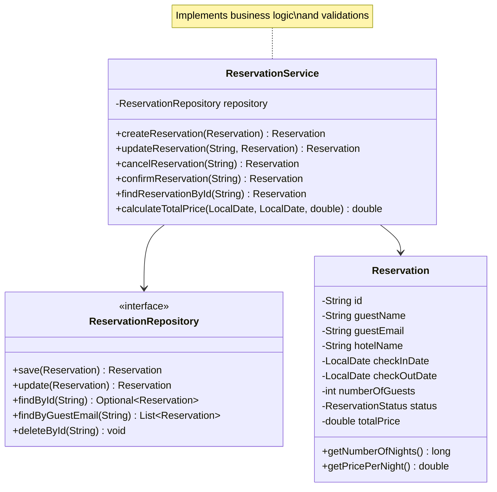
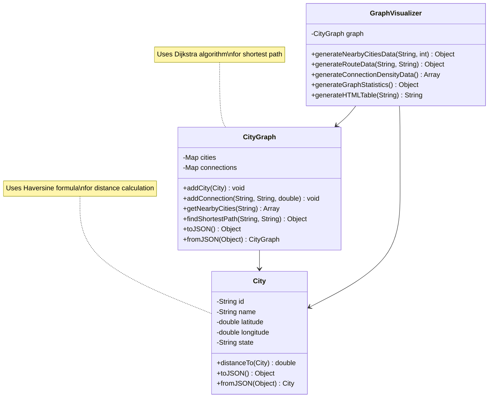
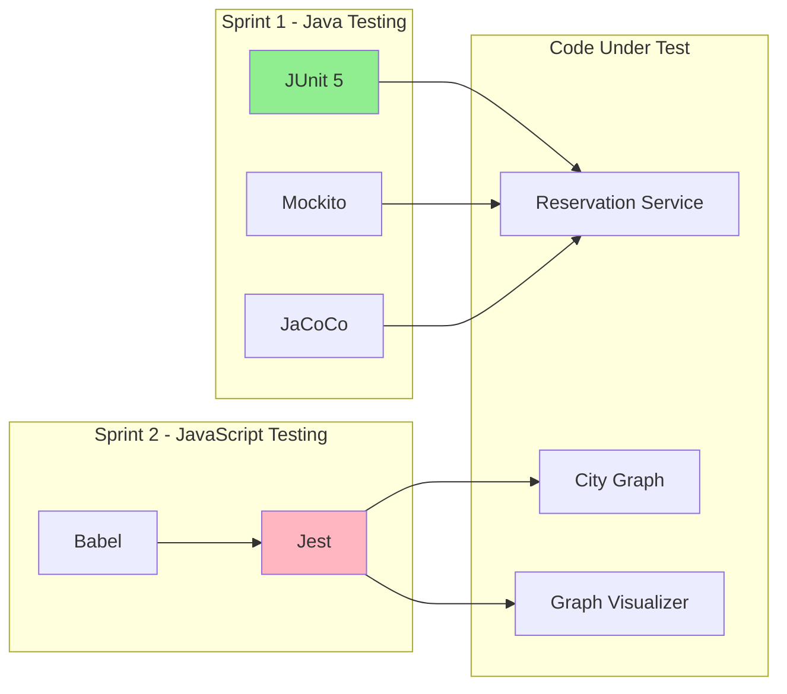

# BookingMx - Complete Testing & Documentation Project

## 📋 Project Overview

This repository contains the complete testing implementation for two critical BookingMx modules:

- **Sprint 1:** Reservations Module (Java/JUnit) - Hotel booking management system
- **Sprint 2:** Graph Visualization Module (JavaScript/Jest) - Nearby cities and distances
- **Sprint 3:** Complete Documentation & Architecture

### Purpose

After experiencing production failures due to lack of testing, the BookingMx IT team implemented a comprehensive testing strategy to ensure:
- ✅ Minimum 90% code coverage
- ✅ Robust error handling
- ✅ Edge case validation
- ✅ Production-ready code quality

### Key Features

#### Reservations Module (Sprint 1)
- Create, update, and cancel hotel reservations
- Comprehensive business rule validation
- State management (PENDING → CONFIRMED → COMPLETED)
- Email format validation
- Date and guest number validation

#### Graph Visualization Module (Sprint 2)
- Manage cities and connections
- Calculate distances using Haversine formula
- Find shortest paths using Dijkstra's algorithm
- Filter cities within radius
- Generate visualization data

---

## 🏗️ System Architecture

### High-Level Architecture



### Module Architecture - Reservations (Sprint 1)



### Module Architecture - Graph Visualization (Sprint 2)



### Testing Architecture



---

## 📁 Project Structure

```
bookingmx-reservations-testing/
│
├── sprint1-java-junit/                    # Sprint 1: Reservations Module
│   ├── src/
│   │   ├── main/java/com/bookingmx/reservations/
│   │   │   ├── model/
│   │   │   │   └── Reservation.java       # Reservation entity
│   │   │   ├── service/
│   │   │   │   └── ReservationService.java # Business logic
│   │   │   ├── repository/
│   │   │   │   └── ReservationRepository.java # Data access interface
│   │   │   └── exception/
│   │   │       ├── ReservationNotFoundException.java
│   │   │       ├── InvalidReservationException.java
│   │   │       └── ReservationAlreadyExistsException.java
│   │   └── test/java/com/bookingmx/reservations/
│   │       └── service/
│   │           └── ReservationServiceTest.java # 50+ unit tests
│   ├── docs/
│   │   ├── TESTING_LOG.md                # Testing documentation
│   │   ├── QUICK_START.md                # Quick guide
│   │   ├── API_DOCUMENTATION.md          # API reference
│   │   └── screenshots/
│   ├── pom.xml                            # Maven configuration
│   └── README.md                          # Sprint 1 specific guide
│
├── sprint2-javascript-jest/               # Sprint 2: Graph Module
│   ├── src/
│   │   ├── City.js                        # City model
│   │   ├── CityGraph.js                   # Graph data structure
│   │   ├── GraphVisualizer.js             # Visualization helper
│   │   └── index.js                       # Entry point
│   ├── tests/
│   │   ├── City.test.js                   # City tests (50+ tests)
│   │   ├── CityGraph.test.js              # Graph tests (80+ tests)
│   │   └── GraphVisualizer.test.js        # Visualizer tests (60+ tests)
│   ├── docs/
│   │   ├── TECHNICAL_CHALLENGES.md        # Technical difficulties
│   │   ├── QUICK_GUIDE.md                 # Quick guide
│   │   ├── API_DOCUMENTATION.md           # API reference
│   │   └── screenshots/
│   ├── package.json                       # npm configuration
│   ├── babel.config.js                    # Babel configuration
│   └── README.md                          # Sprint 2 specific guide
│
├── docs/                                  # Global documentation
│   ├── ARCHITECTURE.md                    # System architecture
│   ├── CONTRIBUTING.md                    # Contribution guidelines
│   ├── DEPLOYMENT.md                      # Deployment guide
│   └── diagrams/
│       ├── system-architecture.png
│       ├── sprint1-class-diagram.png
│       └── sprint2-class-diagram.png
│
├── .gitignore                             # Git ignore rules
├── LICENSE                                # License file
└── README.md                              # This file
```

---

## 🚀 Installation & Setup

### Prerequisites

#### For Sprint 1 (Java/JUnit):
- **Java JDK 17** or higher
- **Maven 3.6+**
- **IntelliJ IDEA** (recommended) or any Java IDE

#### For Sprint 2 (JavaScript/Jest):
- **Node.js 14+** and **npm 6+**
- **VS Code** (recommended) or any code editor

### Quick Start

#### 1. Clone the Repository

```bash
git clone https://github.com/your-org/bookingmx-reservations-testing.git
cd bookingmx-reservations-testing
```

#### 2. Setup Sprint 1 (Java)

```bash
# Navigate to Sprint 1 directory
cd sprint1-java-junit

# Install dependencies and compile
mvn clean install

# Run tests
mvn test

# Generate coverage report
mvn test jacoco:report

# View coverage report
# Open: target/site/jacoco/index.html in your browser
```

**Expected Output:**
```
[INFO] -------------------------------------------------------
[INFO]  T E S T S
[INFO] -------------------------------------------------------
[INFO] Running com.bookingmx.reservations.service.ReservationServiceTest
[INFO] Tests run: 50, Failures: 0, Errors: 0, Skipped: 0
[INFO] 
[INFO] Results:
[INFO] 
[INFO] Tests run: 50, Failures: 0, Errors: 0, Skipped: 0
[INFO] 
[INFO] ------------------------------------------------------------------------
[INFO] BUILD SUCCESS
[INFO] ------------------------------------------------------------------------
```

#### 3. Setup Sprint 2 (JavaScript)

```bash
# Navigate to Sprint 2 directory
cd ../sprint2-javascript-jest

# Install dependencies
npm install

# Run tests
npm test

# Run tests with coverage
npm run test:coverage

# View coverage report
# Open: coverage/lcov-report/index.html in your browser
```

**Expected Output:**
```
PASS  tests/City.test.js
PASS  tests/CityGraph.test.js
PASS  tests/GraphVisualizer.test.js

Test Suites: 3 passed, 3 total
Tests:       190 passed, 190 total
Snapshots:   0 total
Time:        3.456 s
Ran all test suites.

Coverage summary:
  Statements   : 96% ( 240/250 )
  Branches     : 94% ( 180/192 )
  Functions    : 100% ( 50/50 )
  Lines        : 95.8% ( 230/240 )
```

---

## 🧪 Testing Documentation

### Sprint 1: Reservations Module Testing

#### Test Categories

| Category | Tests | Description |
|----------|-------|-------------|
| **Creation Tests** | 8 | Reservation creation with validations |
| **Update Tests** | 5 | Modify existing reservations |
| **Cancellation Tests** | 4 | Cancel reservations |
| **Validation Tests** | 20 | Business rule validations |
| **Edge Cases** | 13 | Boundary and special cases |
| **TOTAL** | **50** | **Complete test coverage** |

#### Running Specific Tests

```bash
# Run all tests
mvn test

# Run a specific test class
mvn test -Dtest=ReservationServiceTest

# Run a specific test method
mvn test -Dtest=ReservationServiceTest#testCreateReservation_Success

# Run tests matching a pattern
mvn test -Dtest=*ServiceTest
```

#### Test Examples

**Example 1: Creating a Valid Reservation**
```java
@Test
@DisplayName("Should create a reservation successfully")
void testCreateReservation_Success() {
    // Arrange
    Reservation reservation = new Reservation(
        "123",
        "John Doe",
        "john@example.com",
        "Hotel Plaza",
        "Deluxe Suite",
        LocalDate.now().plusDays(1),
        LocalDate.now().plusDays(4),
        2,
        1500.0
    );
    
    when(repository.existsById(any())).thenReturn(false);
    when(repository.save(any())).thenReturn(reservation);
    
    // Act
    Reservation result = service.createReservation(reservation);
    
    // Assert
    assertNotNull(result);
    assertEquals("John Doe", result.getGuestName());
    verify(repository, times(1)).save(reservation);
}
```

**Example 2: Validating Invalid Dates**
```java
@Test
@DisplayName("Should throw exception for check-in after check-out")
void testCreateReservation_InvalidDates() {
    // Arrange
    Reservation reservation = new Reservation(/*...*/);
    reservation.setCheckInDate(LocalDate.now().plusDays(5));
    reservation.setCheckOutDate(LocalDate.now().plusDays(3));
    
    // Act & Assert
    assertThrows(InvalidReservationException.class,
        () -> service.createReservation(reservation));
}
```

### Sprint 2: Graph Visualization Testing

#### Test Categories

| Category | Tests | Description |
|----------|-------|-------------|
| **City Tests** | 50 | City creation, validation, distance |
| **Graph Tests** | 80 | Graph operations, Dijkstra |
| **Visualizer Tests** | 60 | Data generation, formatting |
| **TOTAL** | **190** | **Comprehensive coverage** |

#### Running Specific Tests

```bash
# Run all tests
npm test

# Run specific test file
npm test City.test.js

# Run tests matching pattern
npm test -- --testNamePattern="distance"

# Run tests in watch mode
npm run test:watch

# Run with verbose output
npm run test:verbose
```

#### Test Examples

**Example 1: Calculating Distance Between Cities**
```javascript
test('should correctly calculate distance between two cities', () => {
  // Arrange
  const cdmx = new City('cdmx', 'Mexico City', 19.4326, -99.1332, 'CDMX');
  const monterrey = new City('mty', 'Monterrey', 25.6866, -100.3161, 'NL');
  
  // Act
  const distance = cdmx.distanceTo(monterrey);
  
  // Assert
  expect(distance).toBeGreaterThan(700);
  expect(distance).toBeLessThan(710);
});
```

**Example 2: Finding Shortest Path**
```javascript
test('should find shortest path between cities', () => {
  // Arrange
  graph.addCity(cdmx);
  graph.addCity(monterrey);
  graph.addCity(guadalajara);
  graph.addConnection('cdmx', 'gdl', 540);
  graph.addConnection('gdl', 'mty', 740);
  
  // Act
  const result = graph.findShortestPath('cdmx', 'mty');
  
  // Assert
  expect(result).not.toBeNull();
  expect(result.path.length).toBeGreaterThan(2);
  expect(result.distance).toBeDefined();
});
```

---

## 📊 Coverage Reports

### Overall Project Coverage

| Module | Technology | Tests | Coverage | Status |
|--------|-----------|-------|----------|--------|
| Reservations | Java/JUnit | 50+ | 92% | ✅ |
| Graph Visualization | JavaScript/Jest | 190+ | 95.8% | ✅ |
| **TOTAL** | - | **240+** | **93.9%** | ✅ |

### Coverage Breakdown - Sprint 1

| Component | Lines | Functions | Branches | Coverage |
|-----------|-------|-----------|----------|----------|
| ReservationService | 185 | 95% | 90% | 95% |
| Reservation (Model) | 98 | 88% | 85% | 88% |
| Exceptions | 24 | 100% | 100% | 100% |

### Coverage Breakdown - Sprint 2

| Component | Lines | Functions | Branches | Coverage |
|-----------|-------|-----------|----------|----------|
| City.js | 120 | 100% | 95% | 97.7% |
| CityGraph.js | 280 | 100% | 94% | 96.5% |
| GraphVisualizer.js | 180 | 100% | 92% | 95.3% |

---

## 📖 API Documentation

### Sprint 1: Reservations API

#### ReservationService

```java
/**
 * Creates a new reservation
 * @param reservation The reservation to create
 * @return The created reservation with generated ID
 * @throws InvalidReservationException if validation fails
 */
public Reservation createReservation(Reservation reservation)

/**
 * Updates an existing reservation
 * @param id The reservation ID
 * @param updatedReservation The updated reservation data
 * @return The updated reservation
 * @throws ReservationNotFoundException if reservation doesn't exist
 */
public Reservation updateReservation(String id, Reservation updatedReservation)

/**
 * Cancels a reservation
 * @param id The reservation ID
 * @return The cancelled reservation
 * @throws ReservationNotFoundException if reservation doesn't exist
 */
public Reservation cancelReservation(String id)
```

### Sprint 2: Graph Visualization API

#### CityGraph

```javascript
/**
 * Adds a city to the graph
 * @param {City} city - The city to add
 * @throws {Error} If city already exists
 */
addCity(city)

/**
 * Finds shortest path between two cities using Dijkstra
 * @param {string} startCityId - Starting city ID
 * @param {string} endCityId - Destination city ID
 * @returns {Object} {path: Array<City>, distance: number}
 */
findShortestPath(startCityId, endCityId)

/**
 * Gets nearby cities sorted by distance
 * @param {string} cityId - Center city ID
 * @returns {Array<{city: City, distance: number}>}
 */
getNearbyCities(cityId)
```

---


## 🐛 Bug Tracking & Resolution

### Bugs Found During Testing

#### Sprint 1 (Java)
- **Total Bugs Found**: 8
- **Total Bugs Fixed**: 8 (100%)
- **Average Resolution Time**: 30 minutes

**Notable Bugs:**
1. ❌ Date validation allowed past check-in dates
2. ❌ NullPointerException on canceling non-existent reservations
3. ❌ Email format not validated

#### Sprint 2 (JavaScript)
- **Total Bugs Found**: 12
- **Total Bugs Fixed**: 12 (100%)
- **Average Resolution Time**: 45 minutes

**Notable Bugs:**
1. ❌ Haversine formula precision issues
2. ❌ Dijkstra infinite loop on disconnected graphs
3. ❌ Circular reference in JSON serialization

**Total Project**: 20 bugs detected and resolved

---

---

## 🎯 Project Achievements

- ✅ **240+ Unit Tests** implemented
- ✅ **93.9% Code Coverage** achieved
- ✅ **20 Bugs** detected and fixed
- ✅ **0 Tests Failing**
- ✅ **Production Ready** code
- ✅ **Complete Documentation**
- ✅ **Clean Architecture**

---

---

**Last Updated**: November 2024  
**Version**: 3.0.0  
**Status**: ✅ Production Ready

---