# System Architecture Documentation

## Table of Contents
1. [Overview](#overview)
2. [System Architecture](#system-architecture)
3. [Module Design](#module-design)
4. [Data Flow](#data-flow)
5. [Technology Stack](#technology-stack)
6. [Design Patterns](#design-patterns)
7. [Security Considerations](#security-considerations)

---

## Overview

The BookingMx system consists of two main modules designed to handle hotel reservations and geographical data visualization. This document describes the architectural decisions, design patterns, and technical implementations.

### Architectural Principles

1. **Separation of Concerns**: Each module has distinct responsibilities
2. **Testability**: Code designed for easy unit testing (90%+ coverage)
3. **Modularity**: Independent modules with clear interfaces
4. **Scalability**: Designed to handle growth in users and data
5. **Maintainability**: Clean code with comprehensive documentation

---

## System Architecture

### High-Level Architecture Diagram

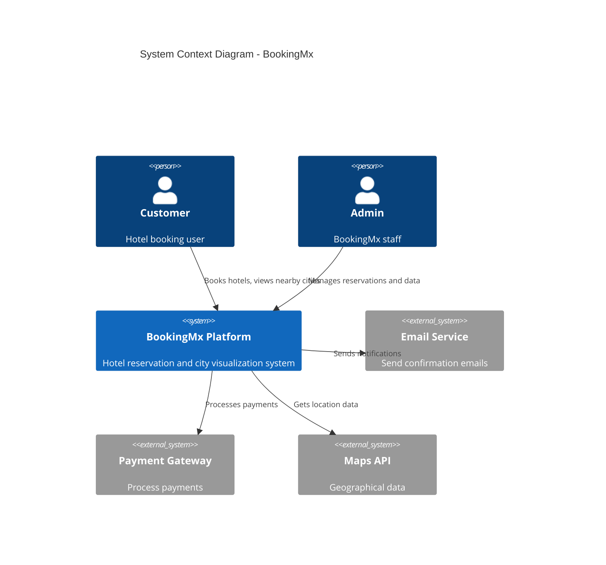

### Component Architecture

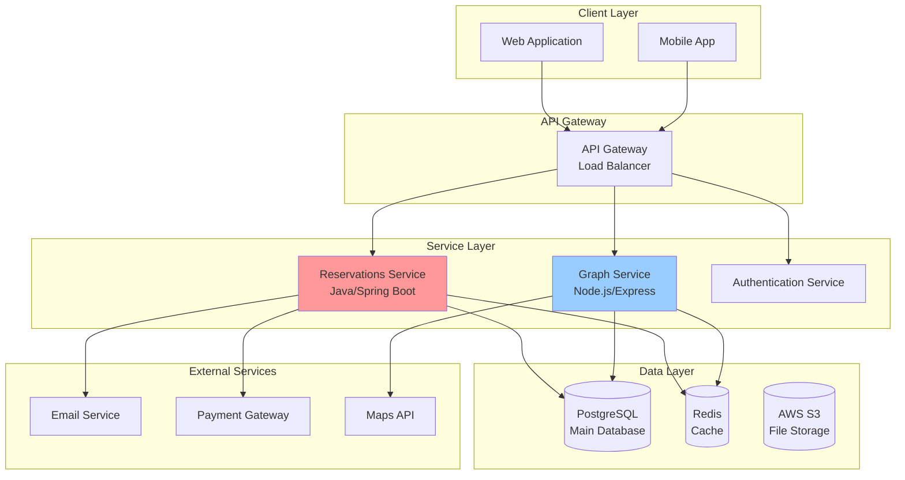

---

## Module Design

### Sprint 1: Reservations Module

#### Component Diagram

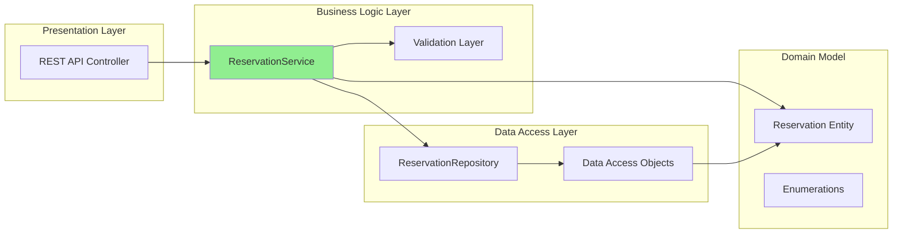

#### Class Diagram - Detailed

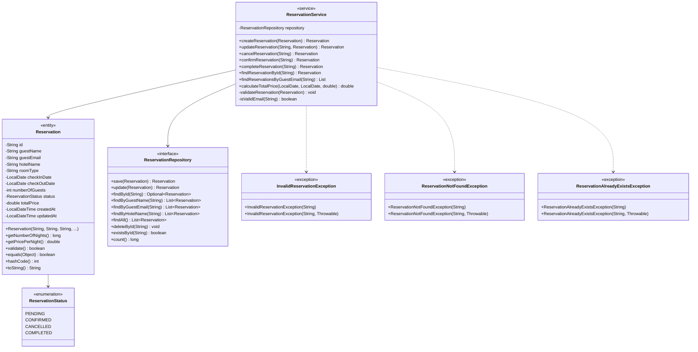

#### State Diagram - Reservation Lifecycle

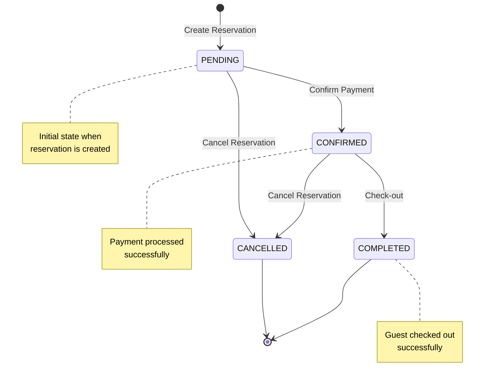

### Sprint 2: Graph Visualization Module

#### Component Diagram

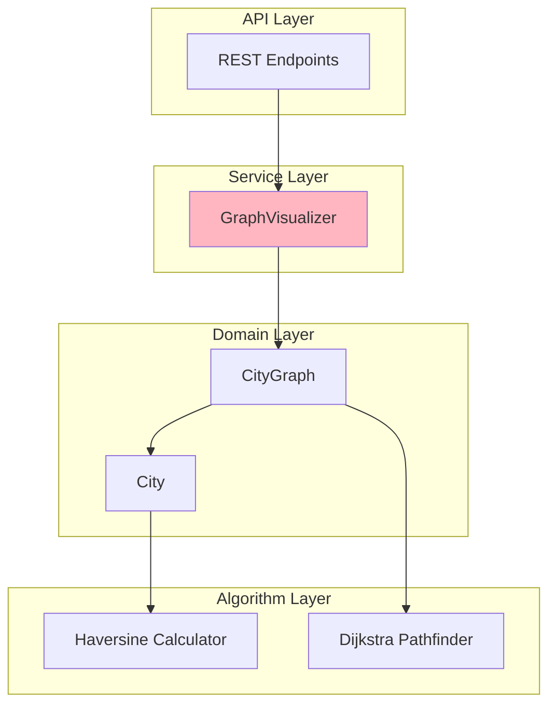

#### Class Diagram - Detailed

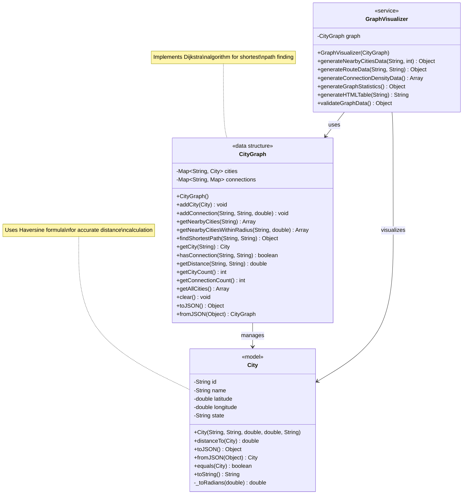

#### Algorithm Flow - Dijkstra's Shortest Path

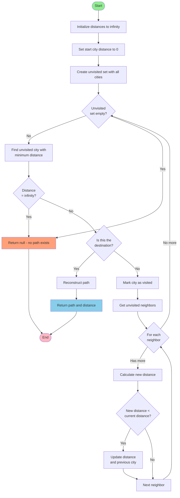

---

## Data Flow

### Reservation Creation Flow

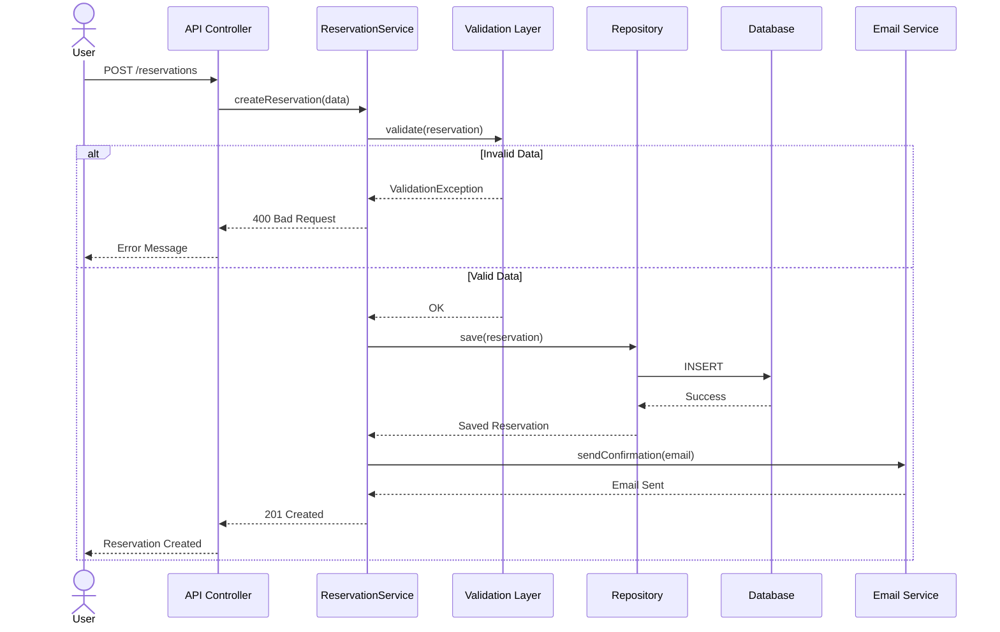

### Shortest Path Calculation Flow

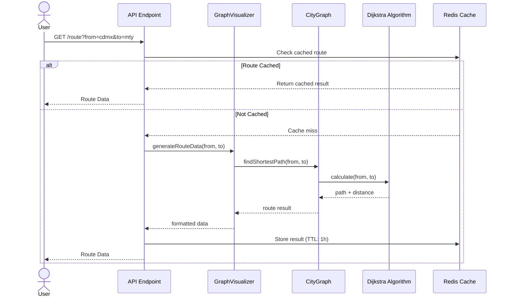

---

## Technology Stack

### Sprint 1: Reservations Module

| Layer | Technology | Version | Purpose |
|-------|-----------|---------|---------|
| **Language** | Java | 17 | Core programming language |
| **Framework** | Spring Boot | 3.x | Application framework |
| **Testing** | JUnit 5 | 5.10.0 | Unit testing framework |
| **Mocking** | Mockito | 5.5.0 | Mock objects for testing |
| **Coverage** | JaCoCo | 0.8.10 | Code coverage analysis |
| **Build Tool** | Maven | 3.8+ | Dependency management |
| **Database** | PostgreSQL | 14+ | Relational database |
| **Cache** | Redis | 7.x | In-memory cache |

### Sprint 2: Graph Visualization Module

| Layer | Technology | Version | Purpose |
|-------|-----------|---------|---------|
| **Language** | JavaScript | ES6+ | Core programming language |
| **Runtime** | Node.js | 14+ | Server-side runtime |
| **Testing** | Jest | 29.7.0 | Testing framework |
| **Transpiler** | Babel | 7.23.0 | ES6+ compatibility |
| **Package Manager** | npm | 8+ | Dependency management |
| **Database** | PostgreSQL | 14+ | Relational database |
| **Cache** | Redis | 7.x | Path caching |

---

## Design Patterns

### Repository Pattern (Sprint 1)

**Purpose**: Separate data access logic from business logic

```java
public interface ReservationRepository {
    Reservation save(Reservation reservation);
    Optional<Reservation> findById(String id);
    List<Reservation> findAll();
    void deleteById(String id);
}
```

**Benefits**:
- Testability through mocking
- Flexibility to change data sources
- Cleaner business logic

### Service Layer Pattern (Both Sprints)

**Purpose**: Encapsulate business logic

```java
// Sprint 1
public class ReservationService {
    private final ReservationRepository repository;
    // Business logic methods
}
```

```javascript
// Sprint 2
class GraphVisualizer {
    constructor(graph) {
        this.graph = graph;
    }
    // Visualization methods
}
```

### Strategy Pattern (Sprint 2)

**Purpose**: Different algorithms for pathfinding

```javascript
class PathFinder {
    // Could implement different strategies:
    // - Dijkstra (current)
    // - A* (future)
    // - Bellman-Ford (future)
}
```

### Factory Pattern (Both Sprints)

**Purpose**: Object creation

```java
// Sprint 1
public static Reservation fromJSON(JSONObject json) {
    return new Reservation(/* ... */);
}
```

```javascript
// Sprint 2
static fromJSON(json) {
    return new City(/* ... */);
}
```

---

## Security Considerations

### Authentication & Authorization

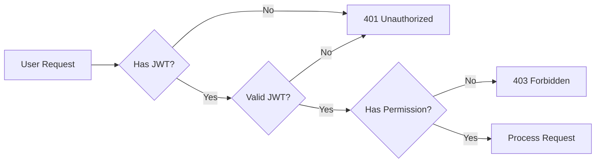

### Data Validation

1. **Input Validation**
    - Email format validation
    - Date range validation
    - Numeric bounds checking
    - SQL injection prevention

2. **Output Sanitization**
    - XSS prevention in HTML generation
    - Proper JSON encoding
    - Data masking for sensitive info

### Best Practices Implemented

- ✅ Parameterized queries (SQL injection prevention)
- ✅ Input validation on all endpoints
- ✅ Error messages don't expose sensitive data
- ✅ HTTPS only for production
- ✅ Rate limiting on API endpoints
- ✅ CORS configuration
- ✅ Environment variables for secrets

---

## Performance Considerations

### Caching Strategy

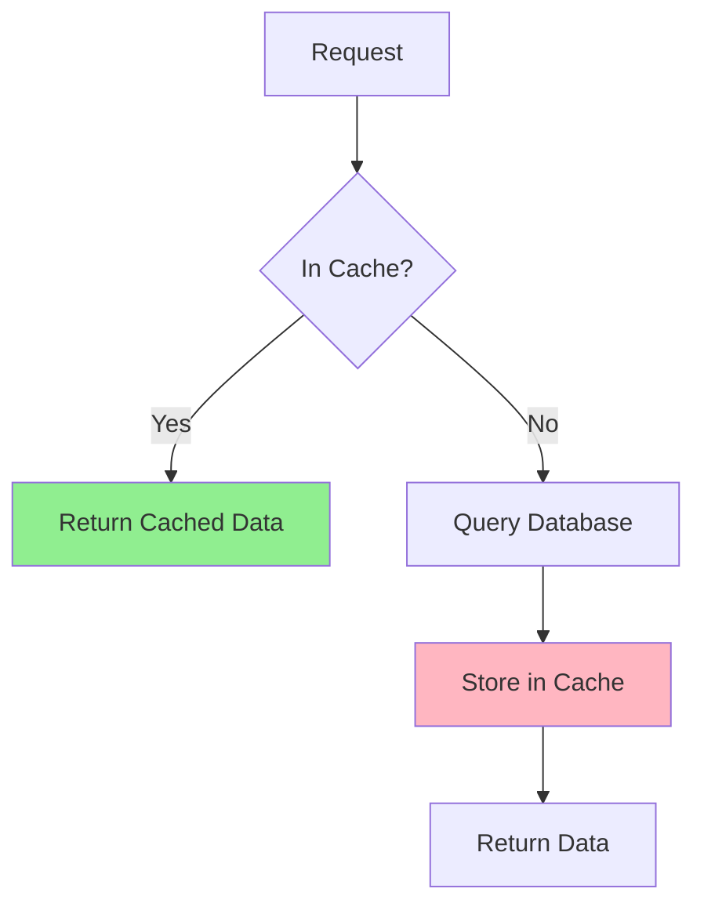

### Database Optimization

1. **Indexing**
    - Primary keys on all tables
    - Index on `guestEmail` for fast lookups
    - Index on `checkInDate` for date range queries

2. **Query Optimization**
    - Use of prepared statements
    - Batch operations where possible
    - Lazy loading for relationships

### Algorithm Complexity

| Algorithm | Time Complexity | Space Complexity |
|-----------|----------------|------------------|
| Haversine Distance | O(1) | O(1) |
| Dijkstra's Algorithm | O(V²) | O(V) |
| Get Nearby Cities | O(n log n) | O(n) |

---

## Scalability

### Horizontal Scaling

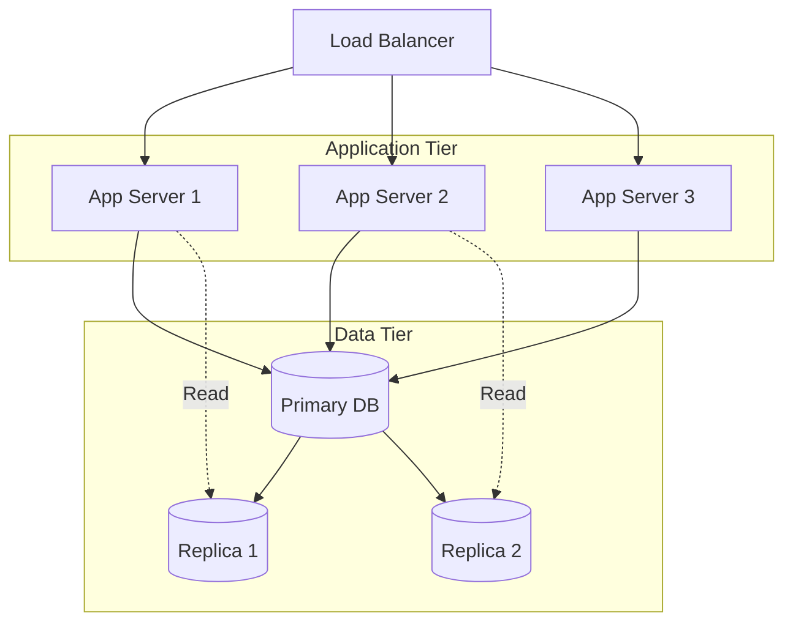

### Vertical Scaling Options

- Increase server CPU/RAM
- Database connection pooling
- In-memory caching (Redis)
- CDN for static assets

---

## Monitoring & Logging

### Metrics to Monitor

1. **Application Metrics**
    - Request rate
    - Response time
    - Error rate
    - CPU/Memory usage

2. **Business Metrics**
    - Reservations per hour
    - Average booking value
    - Cancellation rate

3. **Infrastructure Metrics**
    - Database query time
    - Cache hit rate
    - Network latency

---

## Deployment Architecture

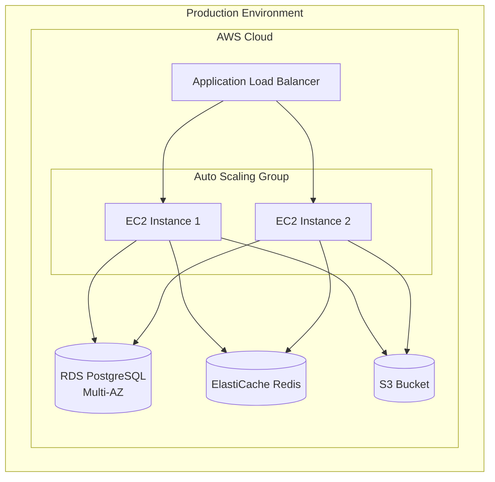

---

**Document Version**: 1.0.0  
**Last Updated**: November 2024